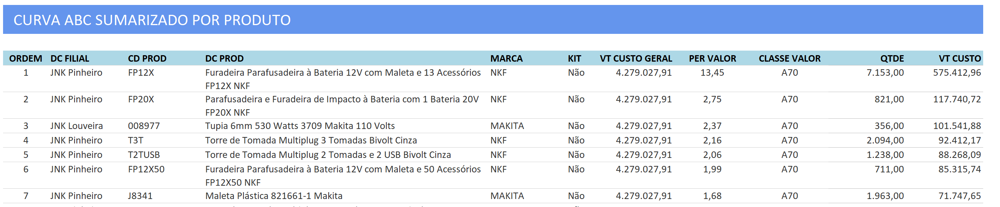

# Módulo de Estoques

## Premissas

### Relatório da Curva ABC de Estoque.
- Baseado na tabela sysemp_estoque_fisico, gerar uma tela onde o usuário poderá consultar e gerar um relatório da curva abc do estoque. A classe que deveremos utilizar é 70/20/10.
- 
- Possibilitar o usuário filtrar: Empresa e Marca

## Consulta de Saldo de Estoque

**Rota:** `/estoque/saldos` · **API:** `/api/estoque/saldos` ·
**Seed:** `026_estoque_saldos_seed.sql`

Consulta direta de `sysemp_estoque_fisico`, a tabela alimentada pela fila da
SysEmp (ver spec de Integração, seção 3.3). Colunas: empresa, código e
descrição do produto, marca, os oito depósitos (disponível, principal,
reservada, importação, avarias, loja, assistência e armazém externo), custo
de formação, custo médio e data da última integração (`synced_at`).

Filtros de empresa, marca, busca (código, descrição, código auxiliar ou
código de barras) e "só com saldo". Paginada em 50, ordenável por qualquer
coluna e exportável para Excel.

Decisões que a distinguem da Curva ABC, que lê a mesma tabela:

- **Mostra linha zerada.** A Curva ABC filtra `saldo_disponivel > 0` porque é
  análise — item sem saldo não classifica. Esta é consulta: mostra a linha
  como ela está, saldo zero ou negativo inclusive, e deixa o corte como
  opção do usuário ("só com saldo").
- **"Só com saldo" soma os oito depósitos com `COALESCE`**, não apenas
  `saldo_disponivel`. Depósito não usado vem `NULL`, e um único `NULL` numa
  soma anularia o total inteiro, escondendo item que tem saldo em outro
  depósito.
- **Nunca lista deletado.** `deleted = FALSE` é a primeira condição do
  `WHERE`, antes até do escopo, e não é opção de tela. O soft delete vem do
  evento `acao='D'` da fila.

**Escopo.** Como toda consulta sobre dado do ERP, restringe às empresas
vinculadas ao usuário, por `condicaoEscopoDeUmaOrigem(escopo, 'SYSEMP', …)` —
a tabela é de uma origem só e não tem coluna de origem, então ter a empresa 4
do KPL não pode liberar a 4 da SysEmp, que é outra companhia. O filtro de
empresa da tela **soma** ao escopo em vez de substituí-lo: pedir empresa fora
do escopo devolve vazio, nunca concede. Escopo vazio vira `1 = 0` — falha
fechada. A exportação para Excel passa pelo mesmo caminho da consulta, então
não é porta lateral para o que a tela não mostraria.

Vale lembrar a distinção que o projeto inteiro mantém: **empresa não é
filial**. O seletor da barra lateral é filial (unidade organizacional); o
recorte destas consultas é empresa do ERP, vinda de `usuarios_empresas`. Ver
`Specs/spec_modulo_faturamento.md`, seção 10.
