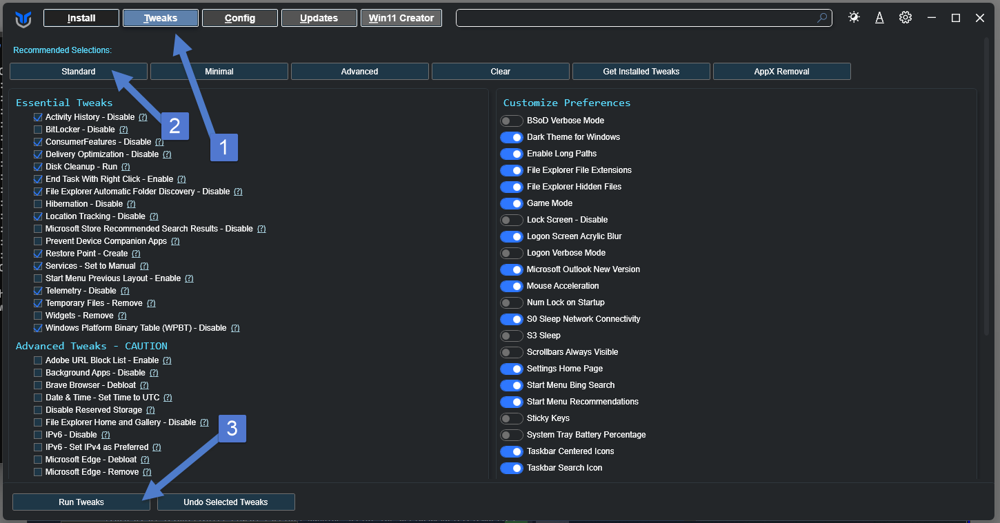
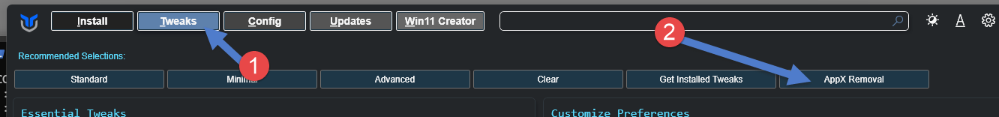
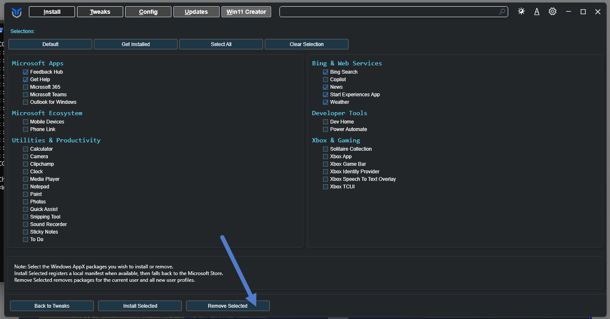

# CHECK LISTA PARA INSTALAÇÃO DE PROGRAMAS NA JNK


## Setar senha do AnyDesk

> A senha real **nao** entra neste arquivo: o repositorio e **publico** e o
> que for commitado fica no historico do git para sempre. Peca a senha de
> acesso nao supervisionado a TI antes de rodar o comando.
```
echo "<SENHA_ACESSO_NAO_SUPERVISIONADO>" | & "C:\Program Files (x86)\AnyDesk\anydesk.exe" --set-password _unattended_access
```

## Desistalar programas Painel de Controle.
``` PS
## Executar no PowerSHell
appwiz.cpl
```

## Desistalar Programas via Chris Titus
``` Chris Titus
## executar no Power Shell (Chris Titus):
irm https://christitus.com/win | iex
```
- Rodar primeiro:


-- Desistalar programas:




## Desativar a Inicialização Rápida

### Comando para ver o tempo de atividade real (Uptime)
- Este comando vai buscar diretamente no sistema a data e a hora exata da última inicialização e calculará há quantos dias, horas e minutos o computador está ligado.
``` ps
## Executar no Power Shell como Administrador
$bootTime = (Get-CimInstance Win32_OperatingSystem).LastBootUpTime
$uptime = (Get-Date) - $bootTime
Write-Host "Último boot completo em: $bootTime" -ForegroundColor Cyan
Write-Host "Tempo de atividade: $($uptime.Days) dias, $($uptime.Hours) horas, $($uptime.Minutes) minutos" -ForegroundColor Green

```
### Para alterar essa configuração definitivamente via PowerShell
- Precisamos desativar o recurso de Inicialização Rápida modificando uma chave no Registro do Windows.Copie e cole o script abaixo em um terminal do PowerShell aberto como Administrador para aplicar a mudança:
```PS
# Caminho da chave de registro do Fast Startup
$registryPath = "HKLM:\SYSTEM\CurrentControlSet\Control\Session Manager\Power"

# Altera o valor de 'HiberbootEnabled' para 0 (Desativado)
Set-ItemProperty -Path $registryPath -Name "HiberbootEnabled" -Value 0

# Confirmação visual para o usuário
Write-Host "A Inicialização Rápida (Fast Startup) foi DESATIVADA com sucesso!" -ForegroundColor Green
Write-Host "A partir de agora, todo desligamento ou reinicialização zerará o tempo de atividade." -ForegroundColor Cyan
```
 ### Como desfazer (Caso queira reativar no futuro)
 Se por algum motivo você precisar ativar a Inicialização Rápida novamente, basta rodar o mesmo comando mudando o valor final para 1:
 ```PS
Set-ItemProperty -Path "HKLM:\SYSTEM\CurrentControlSet\Control\Session Manager\Power" -Name "HiberbootEnabled" -Value 1

 ```

## Pasta Startup no Windows 10
 Para acessar a pasta de inicialização (Startup/Inicializar) no Windows 11 de forma rápida, pressione as teclas Windows + R, digite:
 ```
 shell:startup
 ```
 e pressione Enter.
